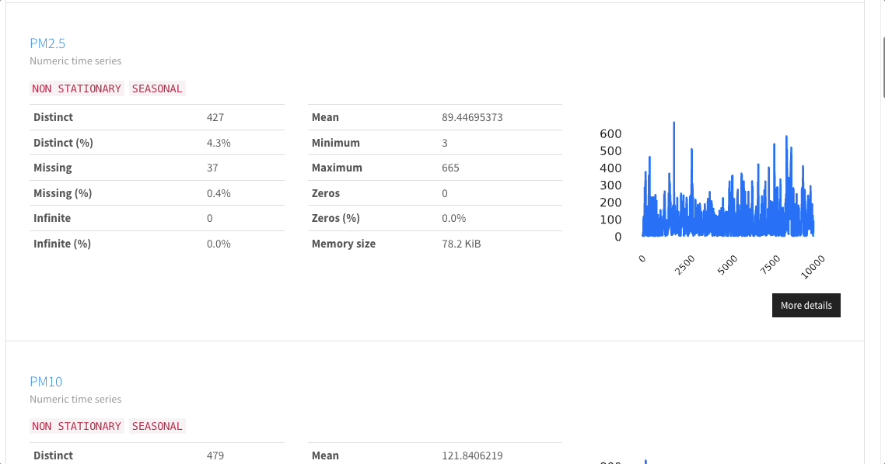

# Time-Series data

`ydata-profiling` can be used for a quick Exploratory Data Analysis on
time-series data. This is useful for a quick understanding on the
behaviour of time dependent variables regarding behaviours such as time
plots, seasonality, trends, stationary and data gaps.

Combined with the profiling reports compare, you're able to compare the
evolution and data behaviour through time, in terms of time-series
specific statistics such as PACF and ACF plots. It also provides the
identification of gaps in the time series, caused either by missing
values or by entries missing in the time index.

!!! example "Time series EDA tutorial"
    
    Do you want to learn how to interpret the time-series profiling
    check out [blog content here](https://ydata.ai/resources/how-to-do-an-eda-for-time-series). 

    You can find the a [otebook with the
    [full code in our examples folder](https://github.com/ydataai/ydata-profiling/tree/develop/examples/usaairquality).

<figure markdown>     
   {width="800"}
   <figcaption>Time-series profiling report</figcaption>
</figure>

## Profiling time-series dataset

The following syntax can be used to generate a profile under the
assumption that the dataset includes time dependent features:

``` python linenums="1" title="Setting the configurations for time-series profiling"
import pandas as pd

from ydata_profiling.utils.cache import cache_file
from ydata_profiling import ProfileReport

file_name = cache_file(
    "pollution_us_2000_2016.csv",
    "https://query.data.world/s/mz5ot3l4zrgvldncfgxu34nda45kvb",
)

df = pd.read_csv(file_name, index_col=[0])

# Filtering time-series to profile a single site
site = df[df["Site Num"] == 3003]

#Enable tsmode to True to automatically identify time-series variables
#Provide the column name that provides the chronological order of your time-series
profile = ProfileReport(df, tsmode=True, sortby="Date Local", title="Time-Series EDA")

profile.to_file("report_timeseries.html")
```

To enable a time-series report to be generated `ts_mode` needs to be set
to `True`. If `True` the variables that have temporal dependence
will be automatically identified based on the presence of
autocorrection. The time-series report uses the `sortby` attribute to
order the dataset. If not provided it is assumed that the dataset is
already ordered.
You can set up the correlation level to detect to apply the time-series 
validation by setting the x configuration. 

### Warnings and validations

Specific to time-series analysis, 2 new warnings were added to the `ydata-profiling`
warnings family: **NON_STATIONARY** and **SEASONAL**.

#### Stationarity
In the realm of time-series analysis, a stationary time-series is a dataset 
where statistical properties, such as mean, variance, and autocorrelation, 
remain constant over time. This property is essential for many time-series 
forecasting and modeling techniques because they often assume that the underlying 
data is stationary. Stationarity simplifies the modeling process by making
it easier to detect patterns and trends.

`ydata-profiling` stationary warning is based on an **Augmented Dickey-Fuller(ADF)** test.
Nevertheless, you should always combine the output of this warning with a visual
inspection to your time-series behaviour and search for variance of the 
rolling statistics analysis. 

#### Seasonality

A seasonal time-series is a specific type of time-series data that exhibits
recurring patterns or fluctuations at regular intervals. These patterns
are known as seasonality and are often observed in data associated with yearly,
monthly, weekly, or daily cycles. Seasonal time-series data can be challenging
to model accurately without addressing the underlying seasonality.

`ydata-profiling` seasonality warning is based on an **Augmented Dickey-Fuller(ADF)** test.
Nevertheless, you should always combine the output of this warning with a seasonal decomposition
PACF and ACF plots (also computed in your time-series profiling).

### Time-series missing gaps

<figure markdown>     
   {width="800"}
   <figcaption>Time-series missing data visualization</figcaption>
</figure>

As a data scientist, one of the critical aspects of working with time-series data
is understanding and analyzing time-series gaps. Time-series gaps refer to the
intervals within your time-series data where observations are missing or incomplete.
While these gaps might seem like inconveniences, they hold valuable information and
can significantly impact the quality and reliability of your analyses and predictions. 

`ydata-profiling` automated identification of potential time-series gaps is based
on time intervals analysis. By analyzing the time intervals between data points,
the gaps are expected to be reflected as larger intervals in the distribution. 

You can set up the configuration and intervals for the missing gaps identification here.

## Customizing time-series variables

In some cases you might be already aware of what variables are expected
to be time-series or, perhaps, you just want to ensure that the
variables that you want to analyze as time-series are profiled as such:

``` python linenums="1" title="Setting what variables are time-series"
import pandas as pd

from ydata_profiling.utils.cache import cache_file
from ydata_profiling import ProfileReport

file_name = cache_file(
    "pollution_us_2000_2016.csv",
    "https://query.data.world/s/mz5ot3l4zrgvldncfgxu34nda45kvb",
)

df = pd.read_csv(file_name, index_col=[0])

# Filtering time-series to profile a single site
site = df[df["Site Num"] == 3003]

# Setting what variables are time series
type_schema = {
    "NO2 Mean": "timeseries",
    "NO2 1st Max Value": "timeseries",
    "NO2 1st Max Hour": "timeseries",
    "NO2 AQI": "timeseries",
}

profile = ProfileReport(
    df,
    tsmode=True,
    type_schema=type_schema,
    sortby="Date Local",
    title="Time-Series EDA for site 3003",
)

profile.to_file("report_timeseries.html")
```

For more questions and suggestions around time-series analysis reach us out at the [Data-Centric AI community](https://datacentricai.community/).

