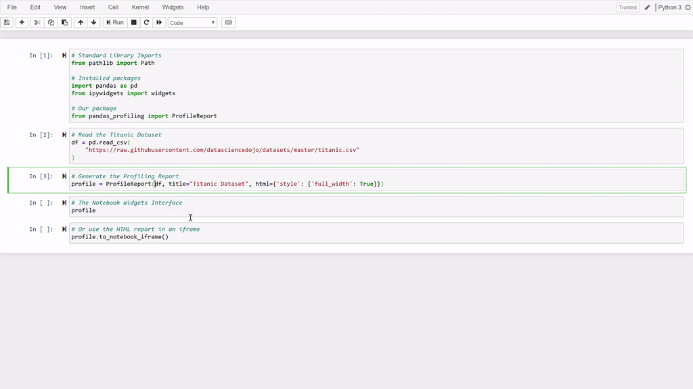

============
Integrations
============

Pandas
------
``pandas-profiling`` is built on ``pandas`` and ``numpy``.
Pandas supports a wide range of data formats including CSV, XLSX, SQL, JSON, HDF5, SAS, BigQuery and Stata.
Read more on `supported formats by Pandas <https://pandas.pydata.org/docs/user_guide/io.html>`_.

Other frameworks
----------------

If you have data in another Python framework, you can use pandas-profiling by converting to a pandas DataFrame. For large datasets you might need to sample. Direct integrations are not yet supported.

.. code-block:: python
  :caption: PySpark to Pandas

   # Convert spark RDD to a pandas DataFrame
   df = spark_df.toPandas()

.. code-block:: python
  :caption: Dask to Pandas

   # Convert dask DataFrame to a pandas DataFrame
   df = df.compute()

.. code-block:: python
  :caption: Vaex to Pandas

   # Convert vaex DataFrame to a pandas DataFrame
   df = df.to_pandas_df()

.. code-block:: python
  :caption: Modin to Pandas

  # Convert modin DataFrame to pandas DataFrame
  df = df._to_pandas()

  # Note that:
  #   "This is not part of the API as pandas.DataFrame, naturally, does not posses such a method.
  #   You can use the private method DataFrame._to_pandas() to do this conversion.
  #   If you would like to do this through the official API you can always save the Modin DataFrame to
  #   storage (csv, hdf, sql, ect) and then read it back using Pandas. This will probably be the safer
  #   way when working big DataFrames, to avoid out of memory issues."
  # Source: https://github.com/modin-project/modin/issues/896

User interfaces
---------------

This section lists the various ways the user can interact with the profiling results.

HTML Report
~~~~~~~~~~~

.. image:: ../_static/iframe.gif

Jupyter Lab/Notebook
~~~~~~~~~~~~~~~~~~~~

Command line
~~~~~~~~~~~~

Command line usage
For standard formatted CSV files that can be read immediately by pandas, you can use the pandas_profiling executable. Run

.. code-block:: console

    pandas_profiling -h

for information about options and arguments.

.. image:: ../_static/cli.png
  :width: 80%

Streamlit
~~~~~~~~~

`Streamlit <https://www.streamlit.io>`_ is an open-source Python library made to build web-apps for machine learning and data science.

.. image:: ../_static/streamlit-integration.gif

.. code-block:: python

  import pandas as pd
  import pandas_profiling
  import streamlit as st
  from streamlit_pandas_profiling import st_profile_report

  df = pd.read_csv(
      "https://raw.githubusercontent.com/datasciencedojo/datasets/master/titanic.csv"
  )
  pr = df.profile_report()

  st.title("Pandas Profiling in Streamlit")
  st.write(df)
  st_profile_report(pr)

You can install this `Pandas Profiling component <https://github.com/Ghasel/streamlit-pandas-profiling>`_ for Streamlit with pip:

.. code-block:: console

  pip install streamlit-pandas-profiling

Panel
~~~~~

For more information on how to use ``pandas-profiling`` in Panel, see https://github.com/pandas-profiling/pandas-profiling/issues/491 and the Pandas Profiling example at https://awesome-panel.org.

Cloud Integrations
------------------

Lambda GPU Cloud
~~~~~~~~~~~~~~~~

.. image:: https://lambdalabs.com/static/images/lambda-logo.png
  :align: right
  :width: 25%

``pandas-profiling`` will be pre-installed on one of the `Lambda GPU Cloud <https://lambdalabs.com/>`_ images. Pandas Profiling itself does not provide GPU acceleration, but does support a workflow in which GPU acceleration is possible, e.g. this is a great setup for profiling your image datasets while developing computer vision applications. Learn how to launch a 4x GPU instance `here <https://www.youtube.com/watch?v=fI3gvaX1crY>`_.

Google Cloud
~~~~~~~~~~~~

The Google Cloud Platform documentation features an article that uses ``pandas-profiling``.

Read it here: `Building a propensity model for financial services on Google Cloud <https://cloud.google.com/solutions/building-a-propensity-model-for-financial-services-on-gcp>`_.

Kaggle
~~~~~~

``pandas-profiling`` is available in `Kaggle notebooks <https://www.kaggle.com/notebooks>`_ by default, as it is included in the `standard Kaggle image <https://github.com/Kaggle/docker-python/blob/master/Dockerfile>`_.

Pipeline Integrations
---------------------

With Python, command-line and Jupyter interfaces, ``pandas-profiling`` integrates seamlessly with DAG execution tools like Airflow, Dagster, Kedro and Prefect.

Integration with `Dagster <https://github.com/dagster-io/dagster>`_ or `Prefect <https://github.com/prefecthq/prefect>`_ can be achieved in a similar way as with Airflow.

Airflow
~~~~~~~

Integration with Airflow can be easily achieved through the `BashOperator <https://airflow.apache.org/docs/stable/_api/airflow/operators/bash_operator/index.html>`_ or the `PythonOperator <https://airflow.apache.org/docs/stable/_api/airflow/operators/python_operator/index.html#airflow.operators.python_operator.PythonOperator>`_.

.. code-block:: python

  # Using the command line interface
  profiling_task = BashOperator(
      task_id="Profile Data",
      bash_command="pandas_profiling dataset.csv report.html",
      dag=dag,
  )

.. code-block:: python

  # Using the Python inferface
  import pandas_profiling

  def profile_data(file_name, report_file):
      df = pd.read_csv(file_name)
      report = pandas_profiling.ProfileReport(df, title="Profiling Report in Airflow")
      report.to_file(report_file)

      return "Report generated at {}".format(report_file)

  profiling_task2 = PythonOperator(
      task_id="Profile Data",
      op_kwargs={"file_name": "dataset.csv", "report_file": "report.html"},
      python_callable=profile_data,
      dag=dag,
  )

Kedro
~~~~~
There is a community created `Kedro plugin <https://github.com/BrickFrog/kedro-pandas-profiling>`_ available.

Editor Integrations
-------------------

PyCharm
~~~~~~~

1. Install ``pandas-profiling`` via the instructions above
2. Locate your ``pandas-profiling`` executable.

  On macOS / Linux / BSD:

  .. code-block:: console

    $ which pandas_profiling
    (example) /usr/local/bin/pandas_profiling

  On Windows:

  .. code-block:: console

    $ where pandas_profiling
    (example) C:\ProgramData\Anaconda3\Scripts\pandas_profiling.exe

3. In Pycharm, go to *Settings* (or *Preferences* on macOS) > *Tools* > *External tools*
4. Click the *+* icon to add a new external tool
5. Insert the following values

  - Name: ``Pandas Profiling``

    - Program: *The location obtained in step 2*
    - Arguments: ``"$FilePath$" "$FileDir$/$FileNameWithoutAllExtensions$_report.html"``
    - Working Directory: ``$ProjectFileDir$``

.. image:: https://pandas-profiling.github.io/pandas-profiling/docs/assets/pycharm-integration.png
  :alt: PyCharm Integration
  :width: 400

To use the PyCharm Integration, right click on any dataset file:
*External Tools* > *Pandas Profiling*.
